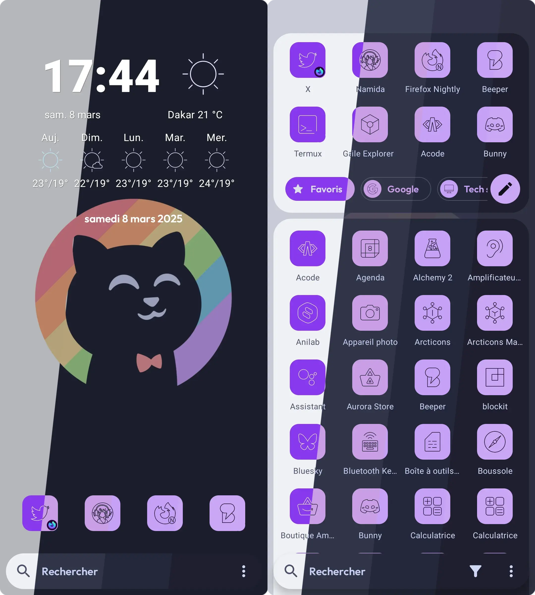

<h3 align="center">
	 
	
	Catppuccin for <a href="https://kvaesitso.mm20.de/">Kvaesitso</a>
	
</h3>

	
	
	

	

## Previews

🌻 Latte

🪴 Frappé

🌺 Macchiato

🌿 Mocha

## Usage

1. Download the theme of your choice inside the theme directory
2. Open Kvaesitso's setting and go to **Appearance** > **Color Scheme** and click the import button on top right.
3. Select the downloaded flavor file.
4. Click on **Import**
> [!IMPORTANT]
> Make sure to use light theme when using Latte and dark theme for the three others.

## 🙋 FAQ

- Q: **_"Kvaesitso's settings are dark in when using Latte"_**\
  A: Yes, it does this for some reason, I've tried fixiing it by I couldn't find the reason why it does so.

- Q: **_"What's the icon theme used in the previews ?"_**\
  A: It's called [Arcticons](https://github.com/Arcticons-Team/Arcticons), install the normal pack. Then go in Kvaesitso's settings, **Grid & icons** and enable "Themed icons".

## 💝 Thanks to

- [claymorwan](https://github.com/claymorwan)

&nbsp;

	

	Copyright &copy; 2021-present <a href="https://github.com/catppuccin" target="_blank">Catppuccin Org</a>

	

